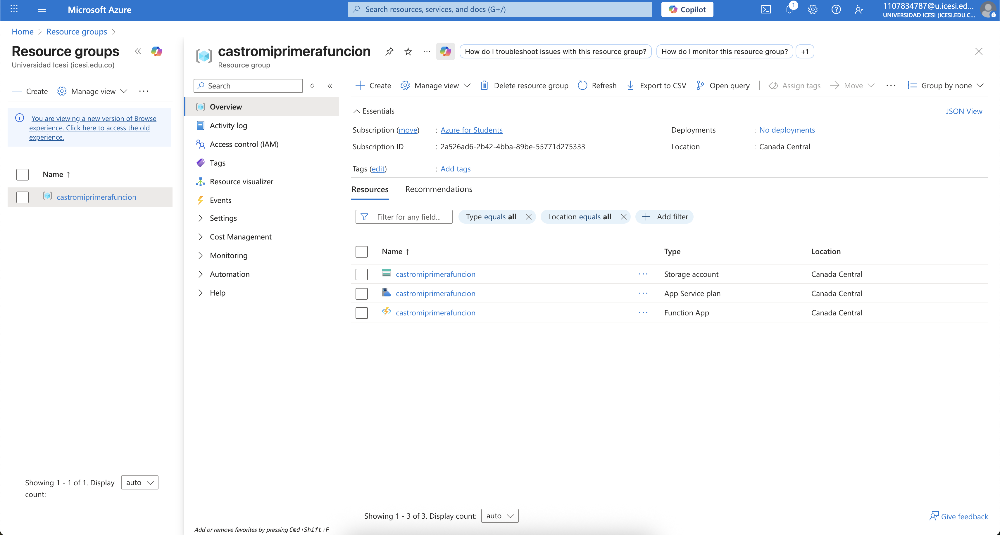

# Despliegue de Azure Function con Terraform

Este repositorio contiene la infraestructura como código (IaC) para desplegar una Azure Function utilizando Terraform. El proceso documenta paso a paso las validaciones realizadas, los errores encontrados y cómo se corrigieron hasta lograr un despliegue exitoso.

## Requisitos previos

Antes de ejecutar los comandos de Terraform, asegúrate de tener instalado:

- Terraform
- Azure CLI
- Una suscripción activa de Azure

### Configuración inicial

Inicia sesión en Azure CLI:
```bash
az login
```

Verifica tu suscripción activa:
```bash
az account show
```

## Pasos para desplegar la infraestructura

### 1. Inicializar Terraform

```bash
terraform init
```

Esto descarga los proveedores necesarios (en este caso `azurerm`) y crea el archivo `.terraform.lock.hcl`.

### 2. Validar la configuración

```bash
terraform validate
```

**Resultado esperado:**
```
Success! The configuration is valid.
```

### 3. Formatear el código

```bash
terraform fmt
```

### 4. Previsualizar los cambios

```bash
terraform plan
```

Aquí se debe ingresar el nombre de la función como variable:

```
var.name_function
  Name Function

  Enter a value: castromiprimerafuncion
```

### 5. Aplicar los cambios (crear la infraestructura en Azure)

```bash
terraform apply
```

Confirmar con `yes`.

## Errores encontrados y soluciones aplicadas

Durante el proceso de despliegue se encontraron varios errores:

### 1. Error de suscripción de Azure

**Error:**
```
building account: unable to configure ResourceManagerAccount: subscription ID could not be determined and was not specified
```

**Causa:** Terraform no podía detectar la suscripción activa en Azure CLI.

**Solución:**
- Se verificó la suscripción con: `az account show`
- Se corrigió la configuración asegurando que la suscripción usada coincidiera con la de Azure CLI (id de la suscripción).

### 2. Error de nombre inválido en Storage Account

**Error:**
```
name ("castro_miprimerafuncion") can only consist of lowercase letters and numbers, and must be between 3 and 24 characters long
```

**Causa:** El nombre contenía un guion bajo `_`, no permitido en cuentas de almacenamiento de Azure.

**Solución:** Cambiar el nombre a solo letras minúsculas y números:
```
castromiprimerafuncion
```

## Resultado final

Al corregir todos los errores, Terraform creó exitosamente:

- **Resource Group**
- **Service Plan**
- **Storage Account**
- **Windows Function App**
- **Azure Function** (HTTP Trigger en Node.js)

La función quedó desplegada y accesible mediante un endpoint HTTP, recibiendo parámetros vía query string o body.

